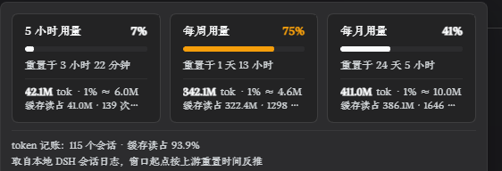

# dsh-oc-usage

DeepSeek Harness（dsh）插件：把 **OpenCode Go / Zen 的额度** 做成对话标题栏右侧的一枚常驻徽标 ——
5 小时 / 每周 / 每月三档用量一眼可见，悬停或点击展开卡片，带重置倒计时与 token 台账。
除额度外还能挂**任意只读接口**当来源（余额、点数、自建网关…）。

> An OpenCode Go / Zen quota badge for DeepSeek Harness (dsh) — a compact header chip showing
> rolling / weekly / monthly usage, plus locally-accounted token spending and user-defined extra
> sources. Chinese comments throughout; see `cordis.patch.yml` for the design notes.

不写死任何密钥：插件只存**凭据引用的名字**，值始终留在 dsh 自己的凭据存储（`~/.dsh/.credentials.yaml`）
或同名环境变量里。

## 它长什么样



- **标题栏徽标**：`5h 12% · 1w 73% · 1m 40%`，用量越高颜色越靠近告警色；取数失败时整枚变红。
- **浮层**（悬停预览 / 点击钉住 / Esc 或点别处收起）：三张卡片（进度条 + 重置倒计时 + 该窗口烧掉的 token），
  下面依次是 token 台账、其它来源、各路由 token 排行。
- **设置页**（设置 → 额度面板）：增删改每一路来源，保存即生效，不用重启。

## 安装

插件由 dsh profile 以 `link:` 方式引入。把本仓库放到任意目录，然后在该 profile 的 `package.json` 里：

```jsonc
{
  "dsh": {
    "profile": {
      "bundles": [
        // …其它 bundle
        "@local/dsh-oc-usage"          // ← 加这一行
      ]
    }
  },
  "dependencies": {
    "@local/dsh-oc-usage": "link:/绝对路径/到/dsh-oc-usage"
  }
}
```

装完重启一次 dsh。之后改这个仓库里的文件：host 半会随 profile 的 patch 热重载（前提是 profile 的
`hmr.root` 覆盖了本目录），客户端那半硬刷新一次页面即可。

## 配置

配置存在 `~/.dsh/dsh-oc-usage.config.json`，三层叠加：**代码默认值 → `cordis.patch.yml` 的 `config`
→ 设置页写下的那个 JSON**。设置页只写最后一层，删掉它即回到上一层。

### 来源（可增删改，最多 12 路）

每一路都是同一件事：拿一个凭据引用，去问一个只读接口。`kind` 决定怎么读那份响应：

| `kind` | 请求 | 期望的响应形状 | 默认 `path` |
| --- | --- | --- | --- |
| `usage` | `GET {baseURL}{path}` | `usage.rolling\|weekly\|monthly{status,percent,resetsAt}` | `/usage` |
| `balance` | `GET {baseURL}{path}` | `{is_available, balance_infos:[{currency,total_balance,…}]}` | `/user/balance` |
| `credits` | `GET {baseURL}{path}` + `GET {baseURL}{infoPath}` | `{data:{total_credits,total_usage}}`（第二个接口是补充信息） | `/credits` + `/key` |
| `generic` | `GET {baseURL}{path}` | 自己用 `valuePath` 取 | 必填 |

字段：

| 字段 | 说明 |
| --- | --- |
| `kind` | 上面四种之一。判不出来会报错，不会猜 |
| `label` | 面板上显示的名字 |
| `enabled` | 停用的来源不出现在浮层里（设置页仍显示它的状态） |
| `baseURL` | 只收 `http(s)://…`，且**不许内嵌凭据**（那会被写进明文配置） |
| `credentialRef` / `credentialRefs` | 凭据引用的名字，一把或多把（多把按顺序试）。**留空 = 不带 Authorization**，公开接口用得上 |
| `path` | 相对路径。只收相对路径：绝对地址与 `//host` 会被拒 —— 否则一个 `path` 就能把带凭据的请求指到别的主机 |
| `infoPath` | 仅 `credits`：补充信息接口，空着就用默认 `/key` |
| `valuePath` | 仅 `generic`：取值路径，语法只有 `a.b[0].c`（对象属性 + 数组下标，封闭解释器，不 eval） |
| `unit` | 仅 `generic`：`money` / `percent` / `tokens` / `number` / `text`，决定前端怎么显示那个数 |
| `currencyPath` / `detailPath` | 仅 `generic`：币种、右侧那行灰字 |

`generic` 的例子（接一个只读接口，没有凭据）：

```json
{
  "sources": {
    "myapi": {
      "kind": "generic",
      "label": "自建网关",
      "enabled": true,
      "baseURL": "https://gateway.example.com/api",
      "credentialRefs": ["MY_GATEWAY_KEY"],
      "path": "/user/info",
      "valuePath": "data.balance",
      "unit": "money",
      "currencyPath": "data.currency",
      "detailPath": "data.plan"
    }
  }
}
```

> 取不到主数值就报「响应里没有 X 这个路径」，**不会拿 0 兜** —— 编出来的 0 会被读成"余额就是 0"。

### 顶层开关

| 字段 | 说明 |
| --- | --- |
| `rollingHours` | 上游 rolling 窗口按几小时折算（默认 5，对应 OpenCode Lite 计划） |
| `routes` | 只把打到 opencode.ai 的路由算进额度对照。留空=自动判：设置里 `baseURL` 含 `opencode.ai` 的路由算数，查不到的历史路由按名字（`open` / `opencode*`）兜底 |

## 面板上的数字都是哪来的

- **三档百分比与重置时间**：上游 `GET {baseURL}{path}` 直接给的，只做归一（认 `percent`，也认
  `used/limit`、`remaining` 之类的别名）。
- **token 台账**：不猜、不估，读 dsh 自己的会话日志（`ctx.sessionQuery`），把 provider 自报的
  `data.usage` 按 1 分钟一桶加总。窗口起点用上游那份 `resetsAt` **反推**（weekly 前 7 天、
  monthly 前一个日历月、rolling `resetsAt − N 小时`，是"只多不少"的保守口径）。种子/分叉会话的
  继承事件、同一步的重试上报都已经按 dsh 自己的 tokenUsage 投影对齐过。
- 只算打到 opencode.ai 的路由；被排除的路由连同 token 一起列在浮层底部，不闷着。

## 安全边界

- 进程里只有**引用名**，密钥永远留在 dsh 的凭据服务里；接口响应不回传密钥内容，只回传它来自哪个
  引用名、哪一代（`oc_sk_` / `sk-` 这种前缀分类）。
- `baseURL` 不接受内嵌凭据；`path` 不接受绝对地址。
- 写配置的 `PUT` 必须带 `x-dsh-oc-usage-config: 1` 头（本地端口上防"某个网页顺手 POST 过来改配置"，
  跨站表单带不了自定义头）。配置里没有密钥，这层防的是误写不是泄密。
- ⚠️ 这是一个**给本地 dsh 用的管理面板**：它会按你配置的地址发带凭据的 GET 请求。别把它暴露到公网，
  也别把 `baseURL` 指向你不信任的主机。

## 测试

```bash
node test/host-load.mjs     # host 半：路由、取数、台账、配置校验（自带临时 home，不碰你的 ~/.dsh）
node test/client-load.mjs   # client 半：桩 React 下跑通 factory + apply，确认槽位注册
```

两个测试都不联网、不读开发机的配置：`host-load.mjs` 会把 `USERPROFILE` 指到一个空临时目录再加载插件，
并自己写一份配置进去。

## 已知限制

- token 台账的增量索引只认 `session.jsonl.zstd`；会话日志的 v3/v4 命名（`session.v3.jsonl.zstd` 等）
  落不进这份索引，那些会话退化成"最多 10 分钟重读一次"。
- 三张卡片与台账窗口固定读 `opencode` 这一路（只有它有 upstream 的 `resetsAt` 可以反推窗口）；
  其它来源只以「其它来源」的行出现。
- 桌面端 / web 端自带的核心版本可能与本插件预期的服务面不同：`llm-pi-ai` 路由表读不到时会退回
  按路由名判断，并在响应里如实写出 `attribution.settings`。

## 许可

[MIT](./LICENSE)。
